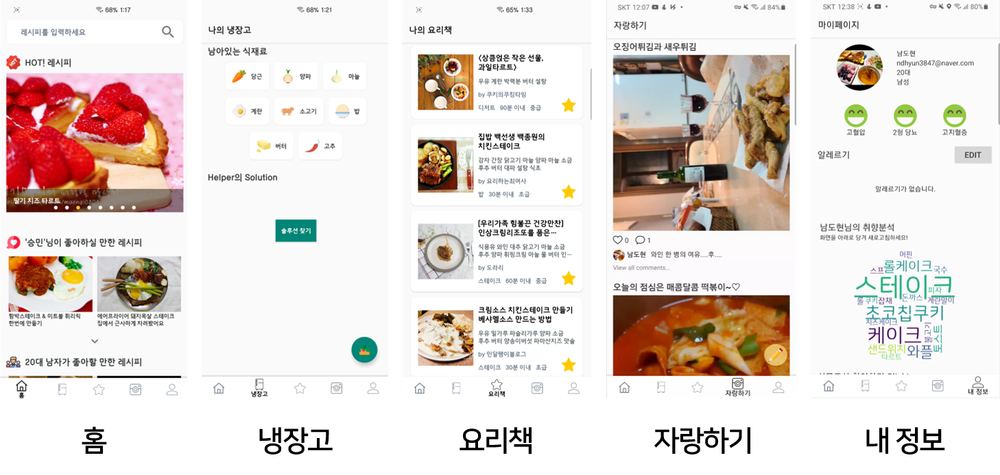
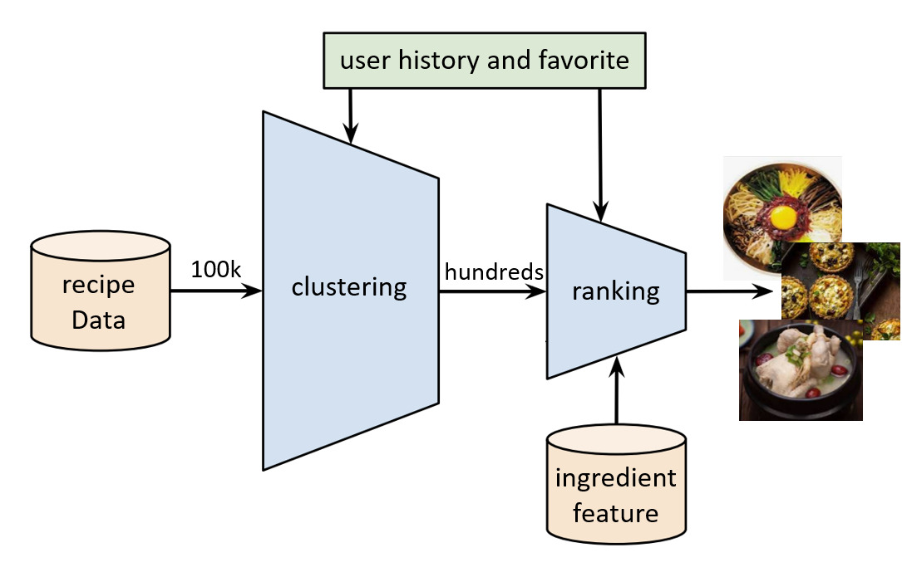

<h1 align="center">
  
   
    Recipe Helper
   
</h1>

<h4 align="center">사용자 기반 레시피 추천 시스템을 적용한 모바일 어플리케이션</h4>

    
    

  <a href="#overview">Overview</a> • 
  <a href="#key-features">Key Features</a> • 
  <a href="#recommender-architecture">Recommender Architecture</a> • 
  <a href="#download">Download</a> •  
  <a href="#credits">Credits</a>

    

## Overview

최근 COVID-19사태로 인하여 집에 있는 시간이 길어지고 이로 인해 사람들은 집에서 즐길 수 있는 취미를 찾기 시작하고 그중 한 가지로 요리를 많이 찾고 있다. 요리에 대한 수요가 증가함에 따라 자연스럽게 레시피에 대한 수요도 증가하고 있는데, 국내 레시피 사이트에서만 18만여 가지 이상의 레시피에서 자신이 하고 싶은, 자신이 먹고 싶은 요리를 찾기란 쉽지 않다. 추천 알고리즘으로 유명한 넷플릭스나 유튜브와 다르게 레시피 사이트들은 사용자의 데이터를 기반으로 한 추천 시스템을 제공하지 않고 있고 이 문제를 본 프로젝트에서 해결해 보고자 하였다. `Recipe Helper`는 사용자 기반의 맞춤형 레시피 추천 시스템으로 성별, 나이, 알레르기, 사용 히스토리 등을 통해 취향을 분석하고 사용자에게 맞는 레시피를 추천해준다.

## Key Features

* 사용자들에게 핫 한 추천
* 사용자가 좋아할 만한 레시피 추천
* 비슷한 연령대, 성별이 좋아하는 레시피 추천
* 입력한 식재료를 기반으로 만들 수 있는 레시피 추천
* 스크랩 기능
* 커뮤니티
* 건강 상태 확인 및 변경
* 취향 분석

## Recommender Architecture

Recipe Helper의 추천 시스템은 **Hybrid Filtering System**이다. 콘텐츠 기반 필터링(CF)을 통해 사용자가 좋은 평가를 내린 레시피와 비슷한 유사도를 갖는 레시피를 찾고, 사용자 기반 협업 필터링(CBF)를 통해 사용자간 유사도를 측정하여 사용자의 레시피에 대한 평가를 기반으로 사용자와 비슷한 다른 사용자를 그룹화 시켜 현재 사용자가 경험해 보지 못한 레시피들 중 사용자가 좋은 평가를 내릴 만한 레시피를 찾아 최종적으로 ranking을 통해 사용자에게 추천해준다.

## Download

최신버전은 `v1.0`으로 [Releases](https://github.com/it-intensive-programming2/recipe_helper/releases/tag/v1.0)에서 다운받을 수 있다.

## Credits

Recipe Helper 은 아래의 오픈 소스를 사용하여 제작되었다.

* [Android Studio](https://developer.android.com/studio)
* [N Cloud](https://www.ncloud.com/)
* [Kakao Developer](https://developers.kakao.com/)
* [Flask](https://flask.palletsprojects.com/en/1.1.x/)
* [Realm](https://realm.io/)
* [Retrofit](https://square.github.io/retrofit/)
* [Glide](https://github.com/bumptech/glide)
* [flexbox-layout](https://github.com/google/flexbox-layout)
* [shimmer-android](https://github.com/facebook/shimmer-android)

> Recipe Helper에 대한 자세한 내용을 보고싶다면 [report](.docs/report.pdf) 참고